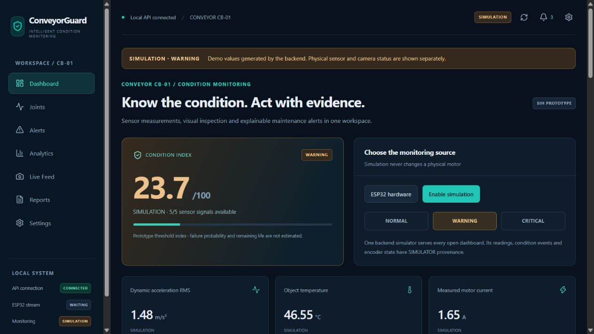
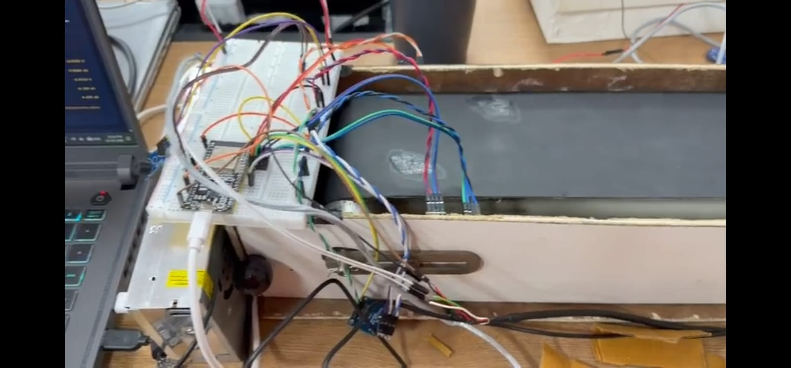
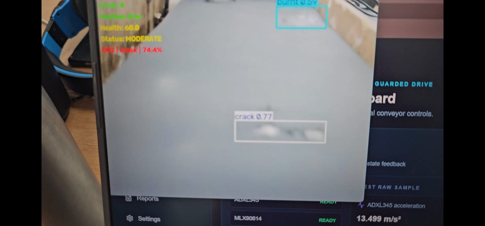
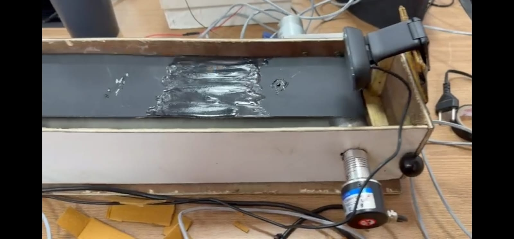
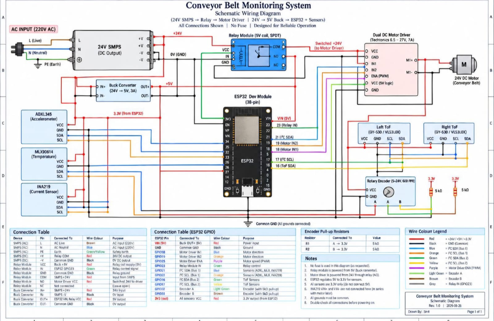
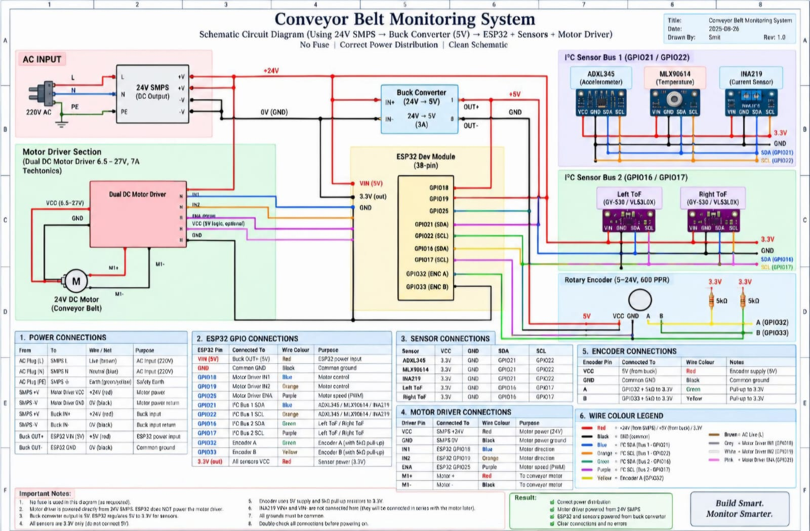
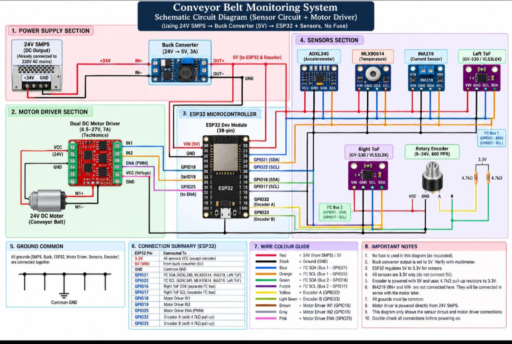
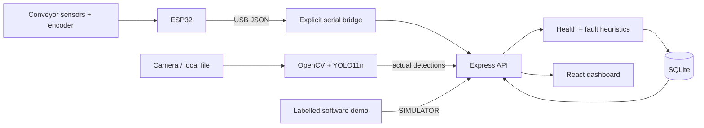

<div align="center">

# ConveyorGuard

### See belt defects. Understand sensor anomalies. Preserve the evidence.

**Intelligent Conveyor Belt Health Monitoring · Smart India Hackathon engineering prototype**


[Run the demo](#quick-start) · [Architecture](docs/architecture.md) · [Hardware](docs/hardware.md) · [Vision](docs/computer-vision.md) · [API](docs/api.md)



</div>

ConveyorGuard combines actual visual detections and source-labelled sensor telemetry in one workspace. Transparent fault rules and persistent alert episodes explain **what changed, why it was flagged, and what evidence should be inspected next**.

The visual detector is trained; the health/fault layer is a prototype heuristic. Demo readings are clearly labelled **SIMULATION**. Missing or stale hardware/camera data stays unknown. There is no claim of industrial certification, validated failure prediction, production readiness, headline AI accuracy or remaining useful life.

## Problem and proposed solution

A camera can reveal surface defects while missing thermal or drive-load anomalies. A temperature/current reading can flag a concern without locating visible damage. ConveyorGuard combines complementary observations while preserving their source and limitations.

The SIH prototype demonstrates observation → explainable condition → stored event → inspection recommendation. It supports a judge-facing software demonstration and a separately enabled ESP32 telemetry path. Physical commissioning and independent model evaluation remain necessary.

## Project status

| Capability | Status | Boundary |
|---|---|---|
| Responsive seven-page dashboard | **IMPLEMENTED** | Actual API errors, freshness and source indicators |
| SQLite history, settings and alerts | **IMPLEMENTED** | Migration, deduplication, acknowledgment, recovery and reports |
| Saved-image OpenCV/YOLO inference | **IMPLEMENTED** | Actual six-class model loaded; three detector boxes persisted in smoke test |
| Camera worker and raw browser preview | **PROTOTYPE** | Capture/cleanup code present; live camera untested here |
| Health/fault rules | **PROTOTYPE** | Threshold index; no trained predictive fault model |
| ESP32 firmware and USB bridges | **PROTOTYPE** | Inspected; physical sensors and firmware compilation unverified here |
| Relative circular defect grouping | **PROTOTYPE** | Fresh calibrated ESP32 encoder required; no physical homing |
| NORMAL / WARNING / CRITICAL scenarios | **SIMULATED** | Every generated row has SIMULATOR provenance |
| Industrial deployment, robust joint identity, RUL | **PLANNED** | Not implemented or validated |

## Hardware prototype evidence

These photographs document the ConveyorGuard physical prototype and its live camera inspection setup. They are evidence of the physical setup, not proof of completed calibration, safety certification, or production readiness.

| Integrated prototype | Live vision result | Belt and camera inspection |
|---|---|---|
|  |  |  |

### Wiring diagrams

These are project reference diagrams for the ESP32, sensors, motor driver, encoder, and power distribution. Verify every connection against the hardware guide before power-up. Use an independent physical emergency stop and appropriate electrical protection; the diagrams do not replace a qualified electrical safety review.

| Detailed schematic | System overview | Sensor and motor layout |
|---|---|---|
|  |  |  |
See [the hardware guide](docs/hardware.md) for pin assignments, commissioning limits and independent emergency-stop requirements.
## Quick start

JavaScript setup is enough for the software demo. Use Node.js 24 and npm (verified locally on Node 24.20.0):

```bash
git clone https://github.com/Om1311gamerz/ConveyorGuard.git
cd ConveyorGuard
npm ci
npm ci --prefix server
npm run demo
```

Open the printed local website URL, usually `http://127.0.0.1:5173`. Choose NORMAL → WARNING → CRITICAL on Dashboard. Banners, readings, charts and reports identify simulation. This command opens no serial device, camera or motor.

| Command | Behaviour |
|---|---|
| `npm run system` | Website + API; unknown hardware readings until telemetry arrives |
| `npm run demo` | Website + API with labelled NORMAL scenario |
| `npm run system:hardware` | Explicit serial watcher + website/API; motor actuation still disabled |
| `npm run check` | Lint, backend syntax, 15 software tests and frontend build |
| `npm run dev` | Frontend only; API starts separately |
| `npm --prefix server start` | API only |
| `npm run build` / `npm run preview` | Build/preview frontend; API remains separate |

Windows `START_CONVEYORGUARD.bat` starts software only. Ctrl+C stops managed children. The launcher chooses free ports and supplies React's actual API URL. A compatible API already on 5000 can be reused and retains its mode/settings; demo startup explicitly changes that shared API into simulation. Stop other launchers before switching independent workflows.

Optional environment files: `.env.example` → `.env` for frontend-only `VITE_API_URL`; `server/.env.example` → `server/.env` for `PORT`, optional `DB_PATH`, `ALLOW_MOTOR_CONTROL=false` and `ALLOW_HISTORY_DELETE=false`. Server environment loading uses a stable path; existing process values take precedence. No external service/API key is required.

## Dashboard features

| Page | Purpose |
|---|---|
| Dashboard | Stream freshness, source, measured units, index, faults and recommendations |
| Joints | Actual Dxx groups; explicitly states physical splice identity is absent |
| Alerts | Persistent ACTIVE/RESOLVED episodes, source filters and acknowledgment |
| Analytics | Stored trends, shared warning thresholds and missing-value gaps |
| Live Feed | Deliberate raw browser preview and actual worker results; no fake overlays |
| Reports | Source-scoped SQLite aggregates, modes and downloadable JSON |
| Settings | Persisted thresholds, geometry/baseline and explicit validity flags |

Raw diagnostics stay separate from health readings. API connection does not imply ESP32 connection; INA219 discovery does not prove valid motor current; an expired camera result does not prove the belt is defect-free.

## System architecture



Sensor architecture: ADXL345 acceleration, MLX90614 object temperature, INA219 electrical diagnostics, two VL53L0X distances and signed quadrature encoder feed ESP32. Two I²C buses separate same-address ToF devices. Valid/calibrated features become health measurements. [Pins, packets and safety](docs/hardware.md).

Vision architecture: OpenCV reads actual frames; custom YOLO11n predicts six classes, boxes and confidence. Results reach SQLite through the API. CAMERA and FILE stay distinct: file analysis cannot influence physical health or invent positions. [Dataset, model and inference](docs/computer-vision.md).

Stack: React 19, Vite 8, Tailwind 4, Recharts, Lucide, Node/Express, better-sqlite3, Python/OpenCV/Ultralytics and ESP32 Arduino. Charts/Analytics load lazily to reduce initial JavaScript.

## Transparent health and fault logic

Defaults live in `config/defaults.json`; saved settings live in SQLite and supply ingestion, rules, charts and simulation. Risk for vibration, temperature, measured current and alignment is 0 below warning, 45 at warning, rising linearly to 100 at critical. Fresh camera priority can add visual risk. Missing inputs are excluded and listed.

**Condition index = 100 − 0.6 × maximum observed risk − 0.4 × mean observed risk.**

This is not failure probability. A partial record can have index 100 while remaining PARTIAL. Rule severity determines WARNING/CRITICAL independently of score bands; availability and calculation are exposed.

Rules: `BELT_MISALIGNMENT`, `MOTOR_OVERLOAD`, `POSSIBLE_JAM`, `ROLLER_BEARING_ANOMALY`, `HIGH_VIBRATION`, `HIGH_TEMPERATURE` and broad visual `BELT_JOINT_DAMAGE`. Each returns contributing signals, explanation and inspection recommendation. Low speed alone may be intentional. [Exact rules and episode semantics](docs/architecture.md).

Vibration is 20-sample dynamic acceleration RMS in **m/s²**, removing each axis's window mean. Gravity-inclusive magnitude is not mm/s velocity, and low-rate telemetry cannot diagnose bearings. Current, alignment deviation and encoder metres stay unknown until corresponding measurement-path/calibration settings are independently verified.

## Defect-position tracking

Signed x4 counts map to relative loop position. Same-class nearby circular positions group into Dxx IDs, counted once per encoder cycle. Tracking requires CAMERA, fresh ESP32 telemetry and calibrated geometry. FILE observations have no position.

Dxx groups are visual associations, not automatic J01 splice identities. Restart/calibration creates a new session while preserving history. Physical homing, slip compensation, camera-offset calibration, synchronized capture timestamps and robust object tracking remain planned.

## Python inference and training

Use Python 3.12 in a virtual environment; [full instructions](docs/computer-vision.md):

```powershell
python -m venv .venv
.\.venv\Scripts\Activate.ps1
python -m pip install torch torchvision --index-url https://download.pytorch.org/whl/cpu
python -m pip install -r vision/requirements.txt -r hardware/requirements.txt
python vision/check_dataset.py
python vision/train_model.py --dry-run
```

Selected dataset: 84 training, 3 validation and 2 test images. Validation lacks three of six classes. Historical metrics are limited provenance, not claimed accuracy. Original weights/datasets are retained; future runs/caches are ignored.

Image inference: `python vision/camera_test.py --source PATH_TO_IMAGE --headless --max-frames 1`. Intentional camera inference: `--source 0` after stopping browser preview. Add `--no-api` for no writes and `--api-url` for a different port. Explicit training: `python vision/train_model.py --epochs 100 --device cpu`. Training was not restarted during this upgrade.

## API and repository guide

Key routes: `/api/beltguard/status`, `/api/sensor-data`, `/api/health/latest`, `/api/alerts`, `/api/reports/summary`, `/api/config`, `/api/demo`, `/api/hardware/serial`, `/api/belt/status`, `/api/vision/detection`, `/api/vision/detections`, `/api/vision/defects`. [Methods, errors and disabled control/deletion gates](docs/api.md).

```text
config/         shared defaults and validity assumptions
src/            React pages, reusable components, polling and API client
server/         Express, SQLite, rules, trackers and tests
vision/         inference/training/validation, selected model and datasets
hardware/       firmware, bridges and diagnostic guide
scripts/        managed local launcher
public/         public frontend assets
docs/           architecture, hardware, vision, API, demo and review
.github/        CI, issue and pull-request templates
```

## Demo, verification and limitations

[Demo walkthrough](docs/demo.md) explains observation → action. [Upgrade review](docs/upgrade-review.md) records the audit/checks. Screenshots show labelled simulation, not hardware evidence.

Verified locally: lint/build, backend syntax and 15 tests, SQLite migration/persistence, scenario recovery/acknowledgment, Python imports/contracts, dataset validation, training dry-run and one real saved-image inference. Remote GitHub CI has not been run by this review.

Unverified: assembled sensors, firmware compilation/upload, live camera, physical E-stop/relay polarity, current path/ratings, calibrated position, live latency, independent model accuracy and industrial thresholds. Motor actuation was not exercised. The local trusted-workstation API has no remote authentication/TLS or production deployment configuration.

## Roadmap and team

1. Commission low-voltage sensors with repeatable calibration and reviewed safety hardware.
2. Expand independent evaluation captures for every class; measure false positives/negatives and latency.
3. Add physical homing, camera/encoder synchronization and slip compensation.
4. Validate higher-rate vibration/load-aware rules with real labelled data.
5. Add retention/export policy, authenticated deployment and reliability testing.

Developed for **Smart India Hackathon**. An official problem-statement ID, institution, registered roster and judging results are not recorded in this repository. Owner: [Om1311gamerz](https://github.com/Om1311gamerz). Add verified team members/roles (embedded, backend/data, vision, frontend, testing) before submission.

Read [Contributing](CONTRIBUTING.md) and [Third-party notices](THIRD_PARTY_NOTICES.md). A project-wide code license still requires the team's choice; this upgrade does not unilaterally relicense upstream models or datasets.
