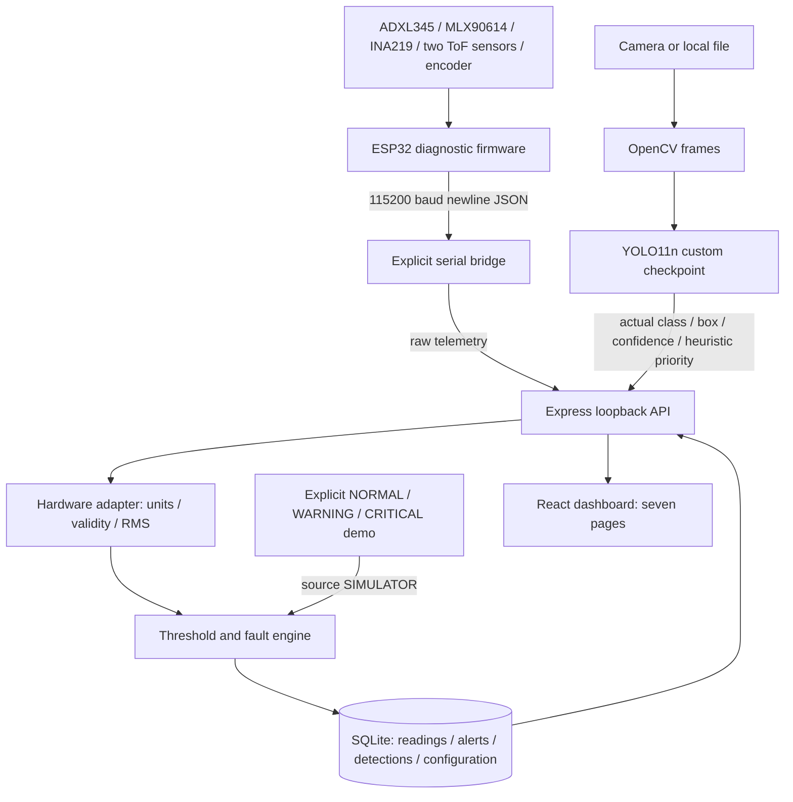

# System architecture

ConveyorGuard is a local, single-conveyor engineering prototype. It combines sensor telemetry and actual YOLO observations, then exposes source-labelled readings, explainable conditions, persistent alerts, and historical reports. The fault engine is a rule system; YOLO is the trained visual detector. Neither component predicts remaining useful life.

## Process boundaries

| Process | Entry point | Responsibility |
|---|---|---|
| React/Vite | `src/main.jsx` | Rendering, backend polling, source-labelled charts, report download, settings forms |
| Node/Express | `server/index.js` → `app.js` | Input validation, configuration, health, source selection, persistent events, tracking, watchdog |
| SQLite | `server/store.js` | Additive schema migration and parameterized storage/querying |
| Serial watcher | `hardware/read_esp32.ps1` or `.py` | Explicit USB telemetry bridge, reconnection, control replies |
| Vision worker | `vision/camera_test.py` | Actual OpenCV capture, detector inference, annotated frames, throttled API submission |
| Local launcher | `scripts/start-system.mjs` | Managed API/Vite children and optional demo or serial watcher |

Default startup does not open a serial device or camera. The launcher binds API and Vite to loopback, chooses free ports, and supplies the actual API URL to the frontend. Python workers need that URL when it differs from port 5000. A compatible API already on port 5000 may be reused; Ctrl+C stops children created by the launcher, not a reused API.

## Provenance and freshness

New sensor rows carry `source` (`ESP32`, `SIMULATOR`, or `UNKNOWN`), `conveyor_id`, server timestamp, nullable measured values, and optional simulation scenario. Simulation is generated once by the backend, not independently in browser tabs. Hardware and simulator encoder states are separate. Browser pages use the currently selected sensor source; reports and alert history offer explicit other-source filters.

Vision observations use `CAMERA`, `FILE`, or `UNKNOWN`. File analysis is persisted and visible as file analysis, but does not influence physical sensor health or create encoder positions. Camera and file heartbeat state are independent, so file analysis cannot clear a live camera fault. The vision card shows the latest submitted source; `visionConnected` in system status specifically means a fresh camera worker.

| Stream | Freshness window | Behaviour after expiry |
|---|---|---|
| Raw ESP32 heartbeat | 600 ms | ESP32 disconnected; running software motor state latches stop |
| Persisted sensor reading | 5 s | UI hides current metrics and index; history remains accessible |
| Encoder sample | 5 s, also gated by ESP32 heartbeat | Position becomes invalid; no camera-position association |
| Actual processed vision frame | 5 s | Coverage unknown; no fabricated clear observation |

These are software defaults in `config/defaults.json`, not measured network guarantees. Last historical health can still be returned with `stale: true`; consumers must inspect freshness. ACTIVE alerts mean last observed unresolved fault and can remain active after disconnection. Disconnection is not recovery.

## Persistence and migration

The database path defaults to `server/conveyor.db`, independent of working directory; `DB_PATH` can override it. SQLite uses WAL and a 5-second busy timeout. Existing sensor columns and values are retained. Old rows receive `UNKNOWN` provenance; their original vibration units cannot be retrospectively verified and they have no newly invented health score.

New tables store shared configuration, alert episodes, actual vision detection JSON, and tracked defect state. Each new sensor insert stores the computed condition and threshold snapshot and reconciles sensor alerts within one transaction. Matching source + conveyor + fault + severity increments an existing episode; recovery or a severity change resolves it. Acknowledgment records a timestamp without deleting the episode. Vision alerts use their own source and are not duplicated as sensor alerts.

Reports aggregate persisted values and persisted health at ingestion. Current health is recalculated with current settings and fresh camera evidence, so a configuration change can change the current index without rewriting history. Report health and current health need not match after a settings change. Unknown rows remain separately selectable.

## Health and fault rules

For vibration, temperature, measured current and alignment, risk is zero below warning, 45 at warning, linearly increasing to 100 at critical, then capped. Fresh camera priority contributes visual risk; a genuinely processed clear camera frame contributes zero. Missing inputs do not become zero risk.

`condition index = 100 − 0.6 × maximum observed risk − 0.4 × mean observed risk`

No observed risk gives an unknown index. Available/missing sensor counts are returned separately; an index of 100 with only temperature available does not establish overall conveyor health. Belt speed alone does not penalize a deliberately stopped conveyor.

| Fault | Trigger | Interpretation |
|---|---|---|
| `BELT_MISALIGNMENT` | Alignment ≥ warning; vibration strengthens explanation | Check baseline and belt centering |
| `POSSIBLE_JAM` | Current ≥ warning and speed < configured low speed | Resistance is possible; deliberate low-speed loading can produce this pattern |
| `MOTOR_OVERLOAD` | Current ≥ warning without low-speed combination | Check actual ratings; no rating is inferred |
| `ROLLER_BEARING_ANOMALY` | Vibration and temperature ≥ warning | Possible combined anomaly; low-rate data cannot diagnose bearings |
| `HIGH_VIBRATION` / `HIGH_TEMPERATURE` | One elevated signal without the combined pattern | Sensor-specific inspection prompt |
| `BELT_JOINT_DAMAGE` | Fresh actual camera detection | Broad visual belt-damage event; not proof that a splice is damaged |

Critical severity follows the relevant critical threshold; the combined roller rule is critical if either input is critical. Vision priority ≥70 is critical. Overall condition uses the highest fault severity, otherwise software stop, otherwise PARTIAL for missing sensors, otherwise NORMAL. Status is determined by rules, not a second arbitrary health-score threshold.

## Defect positions and safety boundary

Signed quadrature count is converted with x4 decoding and wrapped around the configured belt length. Same-class detections within circular position tolerance are associated with Dxx IDs and counted once per encoder cycle. Tracking requires actual CAMERA observations, a fresh ESP32 encoder, and explicit geometry calibration. It is relative to the encoder counter and lacks physical homing, slip compensation and frame/encoder clock synchronization.

Restart, ESP32 startup/time rollback, or hardware configuration changes create a new tracking session. Old detections remain stored, but are not matched against a new origin. This prevents silently treating relative positions across restarts as permanent physical joint identities.

Motor output is disabled by default and blocked during simulation. Stop paths remain available. Software latches/watchdogs are not a physical safety circuit; firmware has no physical E-stop input. No motor operation is part of the demo or automated tests.

The API is intended for a local trusted workstation. Loopback host/origin checks and payload limits reduce accidental misuse, but there is no login, TLS, remote multi-user authorization, retention policy, industrial control protocol or production deployment configuration.
