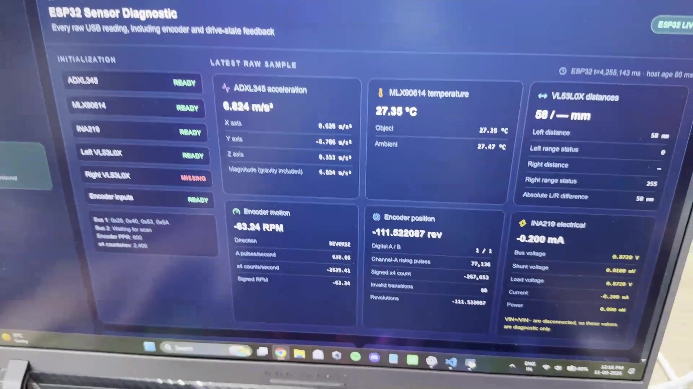

# SIH demo and evidence walkthrough

## Recorded hardware prototype

[](media/beltguard-prototype-demo.mp4?raw=1)

**[Play or download the 18-second prototype video](media/beltguard-prototype-demo.mp4?raw=1).**

If GitHub does not start the embedded preview, use the play/download link. The repository copy uses browser-compatible H.264 video and AAC audio.

The recording shows the physical conveyor, camera and ESP32/sensor wiring, live dashboard telemetry, encoder motion and an on-screen vision overlay. It is the fastest proof that the project has progressed beyond a software-only mock-up.

The recording demonstrates integration on a controlled testbed. It does not measure model accuracy, false alarms, detection latency, avoided downtime, energy savings or mine readiness. Treat those as future validation targets.

## Reproducible software demonstration

The walkthrough below uses a controlled simulator. Say that explicitly at the beginning. It proves software behaviour and stored evidence, not physical measurements or diagnostic performance.

1. Run `npm run demo` and open the printed local URL. Show the SIMULATION banner, connected API, waiting ESP32 and offline camera worker. Explain that these are independent states.
2. Select NORMAL. All five simulated measurements are available and below warning; condition NORMAL, index100, no active simulated faults.
3. Select WARNING. The same shared thresholds drive sensor values and classification. Show the reduced index, WARNING faults and contributing signals. There is no hidden trained fault model.
4. Select CRITICAL. Current is high while simulated speed is low. Explain POSSIBLE_JAM alongside alignment and combined vibration/temperature anomalies. Show inspection recommendations.
5. Open Alerts. A continuing fault increments the same episode's occurrences. WARNING episodes resolve on severity change and CRITICAL episodes are stored separately. Acknowledge an event; this does not delete it or prove recovery.
6. Return to NORMAL. Show that simulated active events resolve and remain in history. Open Reports, select SIMULATION and download JSON. Counts and recorded mode labels come from SQLite.
7. Open Settings. Explain the shared persisted thresholds and unverified hardware flags. Changing a number does not validate a physical sensor or industrial limit.
8. Optionally run saved-image inference from [computer-vision](computer-vision.md). Show an actual annotated result with FILE provenance and no physical belt position. Do not present this as live camera coverage or accuracy evaluation.
9. Select hardware monitoring on Dashboard. The simulator stops, its events remain stored, and physical values stay unknown until actual telemetry arrives. Simulation history never becomes ESP32 history.

Use a separate database for rehearsal so real history is untouched:

```powershell
$env:DB_PATH = Join-Path (Get-Location) 'server/sih-demo.db'
npm run demo
```

Use another filename for a fresh rehearsal rather than deleting history. Database files are ignored by Git. Exit the launcher and clear this terminal's temporary environment assignment before returning to ordinary use. Do not enable motor control for the demo.

Answer judge questions candidly: which inputs are real today, why multiple sources help, what the rules do, why3 validation images are insufficient, why relative grouping is not permanent joint identity, and what commissioning/evaluation is next.
